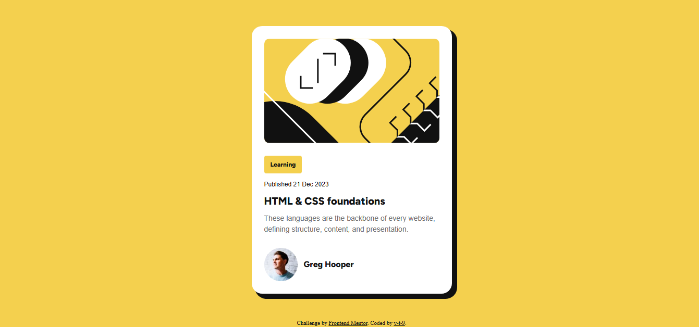

# Frontend Mentor - Blog preview card solution

This is a solution to the [Blog preview card challenge on Frontend Mentor](https://www.frontendmentor.io/challenges/blog-preview-card-ckPaj01IcS). Frontend Mentor challenges help you improve your coding skills by building realistic projects. 

## Table of contents

- [Overview](#overview)
  - [The challenge](#the-challenge)
  - [Screenshot](#screenshot)
  - [Links](#links)
- [My process](#my-process)
  - [Built with](#built-with)
- [Author](#author)

## Overview

### The challenge

### Screenshot

### Links

- Solution URL: (https://github.com/v-t-9/FrontEndMentorBlogCard)
- Live Site URL: (https://v-t-9.github.io/FrontEndMentorBlogCard/)

## My process

### Built with

- Semantic HTML5 markup
- CSS custom properties
- Flexbox
- Mobile-first workflow

## Author
Violeta
- Website -  https://v-t-9.github.io/PortfolioVioleta/
- Frontend Mentor - (https://www.frontendmentor.io/profile/v-t-9)
- Twitter - (https://www.twitter.com/v_t_9)
- Instagram - (https://www.instagram.com/v__t__9/)

